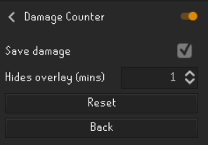

# RuneLite Damage Counter
RuneLite damage counter plugin that currently tracks overall damage inflicted

## Config menu

Config options:
- **Save damage**  allows for saving or resetting the damage after the overlay is hidden.

- **Hides overlay** sets the timer for how many minutes should pass after combat before hiding the overlay